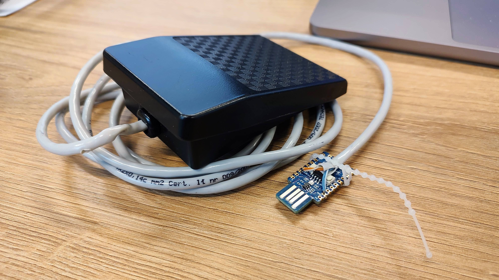
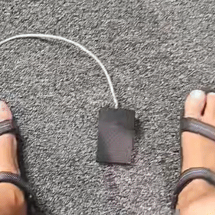

# ClickoPico #

Raspbery Pi Pico based DIY USB footpedal firmware written in CircuitPython. 

If you're interested what kind of a button it is - it's from my daughters toy sewing machine :)

## The idea ##

The idea came to my mind while looking for a solution to a streaming/tv production case, where sign language translators need to be overlayed on top of the video only during specific times of the event. At times the technical director will take them on and off the screen, and there are times when it's the translators that trigger this change. And that poses a challenge, when human or technical resources are sparse.

Using a foot pedal located at the translators booth seems ideal for this purpose, because the sign language talent can put himself on and off air when needed without technical directors intervention. Very often the translators work in pairs and need to change from time to time, wipe their noses, fix their hair, etc. Geting the control in "hands" of people doing the work simplified the workflow and made their work more comfortable.

Initially it was a hackathon-ish idea that I implemented overnight for an event produced by the Multimedia Center at the Lodz University of Technology - MIDI only, made to work directly with vMix. Since it proved useful I dived into the surfaces supported by Bitfocus Companionand ended up with one device that had a fairly simple HID implementation. I left reverse engineering the HID protocol to a lengthy discussion with ChatGPT and a bit of Googling about HID descriptors and reports. It all ended up with what you can find in this repo.

## Installation ##

Install [CircuitPython](https://circuitpython.org/downloads) on your RP2040 board (I used [RP2040-ONE from Waveshare](https://www.waveshare.com/wiki/RP2040-One)). Copy boot.py and code.py to the root folder of the filesystem and adafruit_hid, adatruit_midi, adafruit_debouncer and neopixel libraries to the lib folder (they're a part of the [Adafruit CircuitPython Library Bundle](https://github.com/adafruit/Adafruit_CircuitPython_Bundle/releases/latest) which is a separate download).

Button presses are triggered by shorting appropriate GPIO pins to ground. If the "keypress" is properly recognized the onboard Neopixel LED will light up green and stay on for as long as the button is pressed.

Set your GPIO ports in code.py if you don't want to use the default GP2, GP3, GP4 for the buttons, GP16 for the neopixel. You can change the MIDI notes and velocity if needed too. 

## How it works ##

ClickoPico identifies itself to the operating system as a composite USB device consisting of the default CircuitPython USB nodes (mass storage and CDC COM port) and a HID input device and MIDI device.  It uses a relatively new CircuitPython feature that allows rewriting the default USB VID and PID descriptors. This allows emulating actual devices that already have their support incorporated into other software. 

In my specific case Bitfocus Companion already supports VEC controllers through a NodeJS library called [vec-footpedal](https://www.npmjs.com/package/vec-footpedal). The controller itself uses the HID protocol to pass information (called "reports") about which of its' three buttons are pressed or released. 

## Usage ##
### Bitfocus Companion (HID) ###
After connecting to a USB port, ClickoPico is automatically discovered in Companion as "VEC Footpedal". As with any other surface you can set a default page and offset for it (by default first three buttons on the selected page are mapped to the three foot pedal buttons).
### vMix (MIDI) ###
The MIDI part of ClickoPico "just works" and can be used (e.g. in vMix shortcuts) out of the box.
